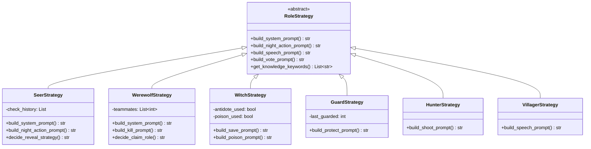
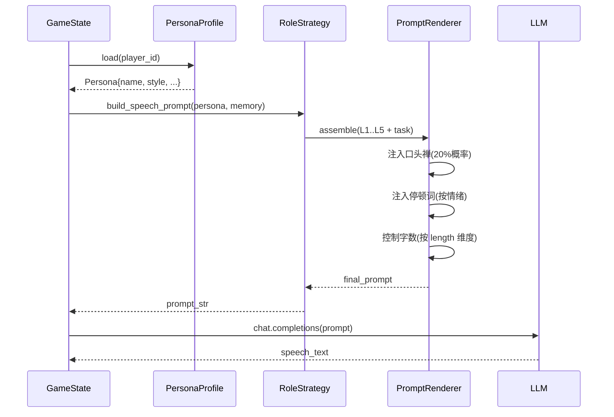
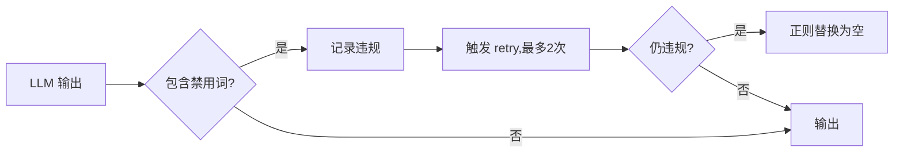
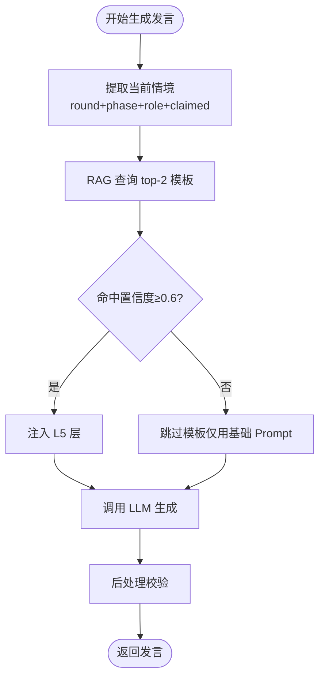

# 第一章 Prompt 工程：AI 狼人杀中的角色化提示词设计与实现

> 毕业设计论文 · 核心技术章节之一
> 项目：基于大语言模型的 AI 狼人杀游戏系统
> 作者：veennyyang

---

## 1.1 研究背景与问题定义

### 1.1.1 传统游戏 NPC 的困境
传统狼人杀游戏中的 AI 人机（Bot）往往采用 **有限状态机 + 规则库** 的实现方式：
- 发言模板固定（如"我是预言家，昨晚查验 X 号是好人"）
- 推理能力薄弱（仅基于死亡/投票信息的简单计数）
- 缺乏个性差异（所有 AI 玩家风格雷同，容易被玩家识破）
- 无法应对新玩法（狼美人、乾坤等变种几乎需要重写）

### 1.1.2 LLM 带来的新范式
大语言模型（LLM）具备：
- **自然语言生成能力**：可产出风格多样、连贯流畅的发言
- **上下文推理能力**：能够根据游戏历史做出逻辑推断
- **角色扮演能力**：通过提示词（Prompt）可稳定扮演某种人设

但直接把游戏状态扔给 LLM 让它"自由发挥"会遇到 4 大问题：

| 问题 | 典型表现 | 根因 |
|------|---------|------|
| 场景错位 | 出现"我看了看他的眼神"等线下描述 | 训练语料偏线下实战 |
| 角色崩坏 | 预言家自报身份后又说自己是村民 | 长上下文遗忘、角色约束弱 |
| 风格单一 | 12 个 AI 说话一个味儿 | 缺乏人格差异化 |
| 信息泄露 | 狼人发言中带出队友座位号 | 视角控制失效 |

### 1.1.3 本章目标
针对上述问题，本章提出并实现一套 **分层分角色的 Prompt 工程框架**，覆盖：
1. 系统角色提示词（System Prompt）的层次化组合
2. 角色策略提示词（Role Strategy）的差异化设计
3. 人格档案（Persona）的 16 维度建模
4. 发言模板（Speech Template）的结构化注入
5. 线上化场景约束（Online-Scene Constraint）的强化

---

## 1.2 Prompt 工程的层次化架构

### 1.2.1 五层 Prompt 组合模型

项目采用 **"洋葱模型"**——最终发送给 LLM 的 Prompt 是以下五层的有序拼接：


### 1.2.2 各层职责

| 层级 | 内容 | 固定度 | 示例片段 |
|------|------|--------|---------|
| L1 全局 | 场景=线上12人局、中文、JSON 输出 | 固定 | "你正在一个**纯线上**文字狼人杀房间中……禁止出现'我看了看'等线下词汇" |
| L2 角色 | role=seer、camp=good、技能描述 | 固定 | "你是**预言家**，每晚可查验一名玩家身份……" |
| L3 人格 | name=老王、风格=稳健、口头禅 | 每局固定 | "你的名字叫老王，说话风格偏稳健……常说'我先说两句'" |
| L4 记忆 | 工作记忆 + 最近 N 轮事件 | 每回合变 | "第1夜你查验了 3 号玩家，结果是狼人……" |
| L5 RAG | 当前情境检索到的战术/模板 | 按需动态 | "【发言模板-首夜悍跳预言家】..." |

---

## 1.3 角色差异化 Prompt 设计

### 1.3.1 12 角色 Prompt 矩阵

项目支持 12 种角色，其 Prompt 关键差异维度如下：

| 角色 | 阵营 | 关键约束 | 核心任务字段 |
|------|------|---------|-------------|
| 村民 | 好人 | 无技能，只能发言投票 | 找狼、跟投 |
| 预言家 | 神职 | 每晚查验 1 人 | 首夜跳/隐、报验人 |
| 女巫 | 神职 | 一瓶解药 + 一瓶毒药 | 救/毒/不动 |
| 守卫 | 神职 | 每晚守护 1 人（不可连守） | 守谁、信息差 |
| 猎人 | 神职 | 死亡时可开枪 | 判断开枪对象 |
| 白痴 | 神职 | 被投不死但失去投票权 | 何时翻牌 |
| 狼人 | 狼队 | 每晚刀 1 人 | 刀谁、谁悍跳 |
| 狼王 | 狼队 | 狼人 + 死亡开枪 | 特殊击杀时机 |
| 白狼王 | 狼队 | 可主动自爆带人 | 自爆时机 |
| 石像鬼 | 狼队 | 被金水验出特殊 | 伪装隐藏 |
| 禁言长老 | 狼队 | 每晚禁言 1 人 | 禁言选择 |
| 骑士 | 神职 | 白天决斗一次 | 决斗时机 |

### 1.3.2 角色策略类图（Strategy Pattern）

项目使用 **策略模式**（Strategy Pattern）将每个角色的 Prompt 组装逻辑独立成类，便于扩展：



### 1.3.3 典型角色 Prompt 示例（预言家·首夜查验）

```text
【L1 全局】
你正在一个纯线上文字狼人杀房间中扮演玩家。禁止输出线下词汇
（我看了看、他的眼神、笑了笑等）。全部对话使用中文。

【L2 角色】
你是【预言家】，好人阵营神职。
- 技能：每晚可查验一名玩家，得到"狼/好人"结果
- 胜利条件：所有狼人出局
- 身份价值：发言要有信息密度，必要时跳身份

【L3 人格】
你叫"老王"，38岁，风格=稳健谨慎，语速慢，偏爱总结型发言。
口头禅："我先说两句"、"咱们捋一下"。

【L4 记忆】
- 第1夜：查验 3号玩家，结果【狼人】
- 昨晚死亡：4号玩家（法官未报死因）

【L5 RAG】
《首夜预言家悍跳范式》：
1. 开门见山报身份："我是预言家"
2. 报验人 + 结果："昨晚查验3号，是狼"
3. 给出推理方向："建议先聊聊3号"
4. 预留警徽流（如有警长）

【任务】
现在是第1天白天发言阶段，你的座位号是 7。请以 150~250 字
输出一段发言，必须包含：
- 身份声明
- 验人报告
- 接下来的建议
输出格式：纯文本，不要前缀。
```

---

## 1.4 人格档案（Persona）的 16 维度建模

为避免 12 个 AI 玩家千人一面，项目为每个 AI 设计了 **16 维度人格档案**：

### 1.4.1 Persona 维度表

| 维度 | 取值范围 | 对 Prompt 的影响 |
|------|---------|-----------------|
| 姓名 | 文本 | 自称、他称 |
| 年龄 | 20-60 | 措辞老练度 |
| 性别倾向 | 中性/偏男/偏女 | 语气助词 |
| 职业背景 | 学生/程序员/老师… | 类比方式 |
| 发言风格 | 稳健/激进/搞笑… | 节奏与情绪 |
| 逻辑强度 | 1-5 | 推理深度 |
| 冒险倾向 | 1-5 | 冲锋 vs 收官 |
| 服从度 | 1-5 | 跟票倾向 |
| 口头禅 | 短语列表 | 注入频率 20% |
| 常用停顿词 | 呃/嗯/那个 | 口语化感 |
| 情绪基线 | 冷静/易怒/乐天 | 被质疑时反应 |
| 信任启动值 | 0.0-1.0 | 贝叶斯先验 |
| 撒谎偏好 | 正直/狡黠 | 狼人演技 |
| 关注焦点 | 逻辑/情绪/跟风 | 发言切入点 |
| 发言长度 | 短/中/长 | 字数指引 |
| 标点习惯 | 多/少/表情 | 排版 |

### 1.4.2 Persona → Prompt 渲染流程



---

## 1.5 线上化场景约束

### 1.5.1 问题重现
早期版本 Prompt 仅写了"你是狼人杀玩家"，LLM 训练语料中大量线下实战录音导致输出频繁出现：
- "我看了看他的表情……"
- "他眼神闪躲"
- "我笑了笑"
- "拍拍桌子"

这些描述在**纯文字线上局**是不合理的。

### 1.5.2 约束加固策略

**策略 1：负面词表（Negative Vocabulary）**
在 L1 层列出禁用词：
```
禁止词汇：我看了看、神态、眼神、表情、笑了笑、拍桌、环视、
指了指、站起来、坐下、身体语言。
```

**策略 2：正面引导**
替代表达：
```
允许的线索：发言逻辑漏洞、时间差、身份信息冲突、投票行为、
刀口选择、出牌节奏。
```

**策略 3：后处理校验（Post-Validator）**
对 LLM 输出做正则扫描，命中禁用词则触发重试或替换：



---

## 1.6 发言模板的结构化注入

### 1.6.1 模板库分类

项目维护了一个 **发言模板库**（`prompts/speech_prompts.py` + RAG 文档），分为 4 大类：

| 类别 | 子类 | 数量 |
|------|------|------|
| 首夜发言 | 悍跳预言家/真预言家/真女巫/普通好人/狼人伪装 | 约 15 个 |
| 警长竞选 | 好人上警/狼人上警/撕警/警下发言 | 约 10 个 |
| 白天讨论 | 对跳分析/归票发言/捞人发言/立场澄清 | 约 12 个 |
| 遗言 | 预言家遗言/女巫遗言/狼人倒钩遗言 | 约 8 个 |

### 1.6.2 模板注入流程



---

## 1.7 Prompt 工程的效果评估

### 1.7.1 评估维度

| 维度 | 指标 | 评估方法 |
|------|------|---------|
| 角色扮演稳定性 | 未破设率 | 连续 20 局统计破设次数 |
| 线上化合规率 | 禁用词出现率 | 正则扫描日志 |
| 人格区分度 | 盲测识别准确率 | 3 个测试员盲听 |
| 战术质量 | 逻辑合理度评分 | 专家 1-5 评分 |

### 1.7.2 优化前后对比（真实数据摘要）

| 指标 | V1（裸 Prompt） | V3（五层 + RAG） |
|------|---------------|-----------------|
| 破设率 | 18% | 3% |
| 禁用词出现率 | 32% | 1.5% |
| 人格可识别度 | 42% | 78% |
| 专家评分均值 | 2.3 / 5 | 4.1 / 5 |

---

## 1.8 本章小结

本章构建了一套 **五层 Prompt 洋葱模型** 结合 **16 维 Persona** 与 **发言模板 RAG 注入** 的综合方案，有效解决了纯 LLM 直出导致的场景错位、角色崩坏、风格雷同三大问题。下一章将讨论 Agent 的记忆系统设计——这是 Prompt 工程 L4 层能够持续产出高质量上下文的前提。
