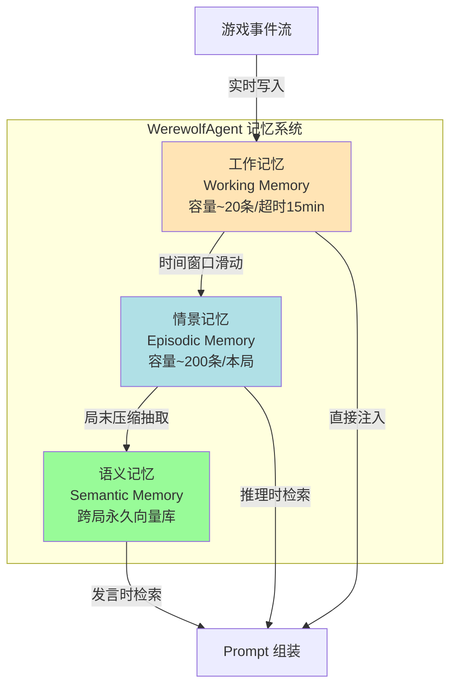
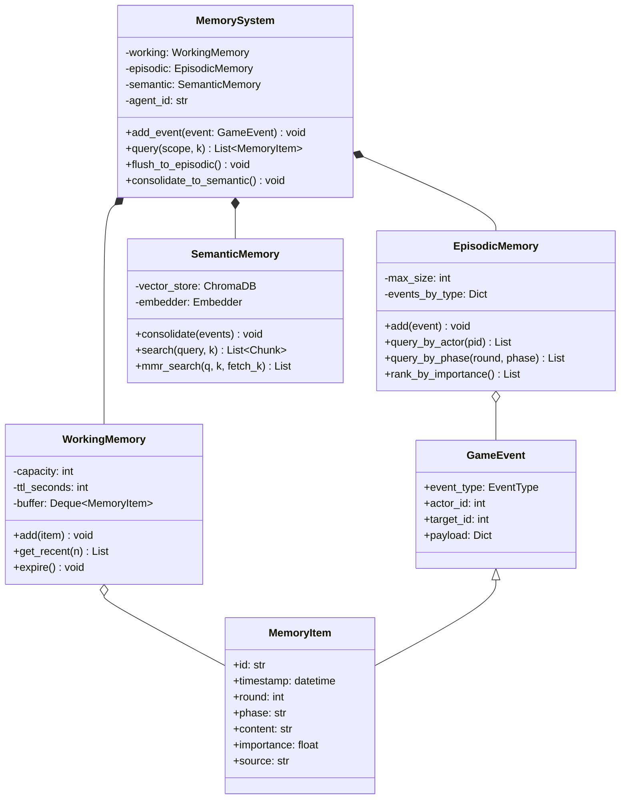
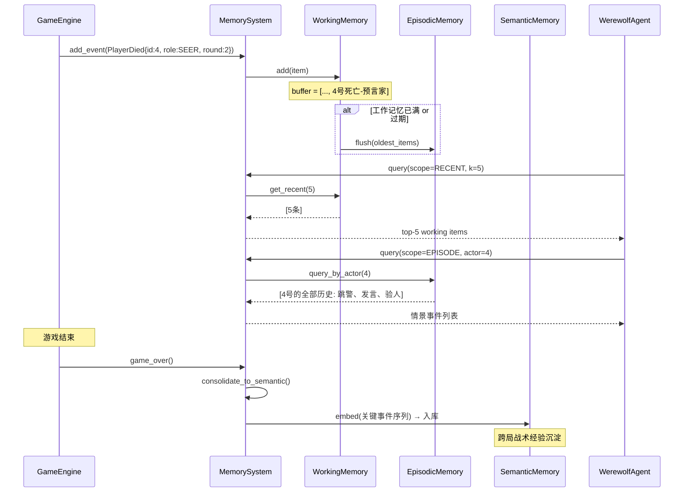
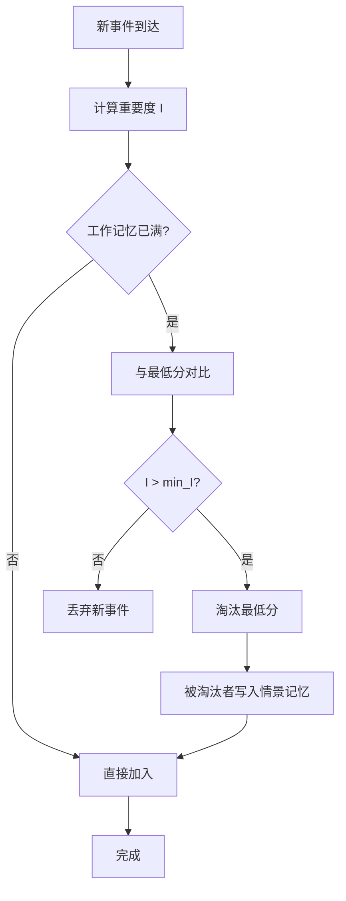
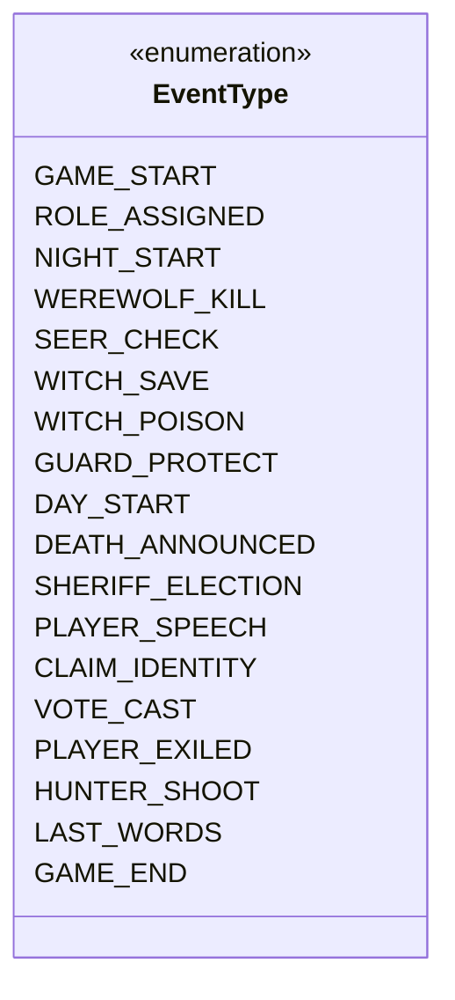
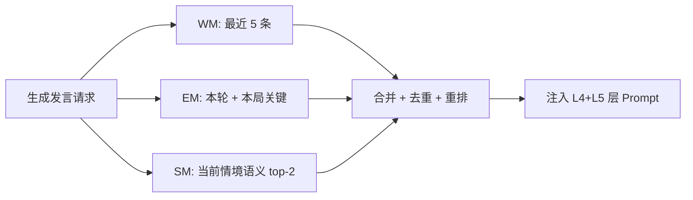
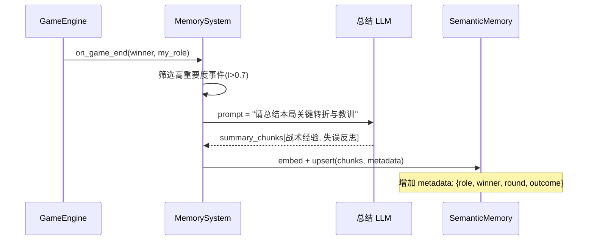

# 第二章 Agent 记忆系统：三层记忆架构与遗忘机制

> 毕业设计论文 · 核心技术章节之二
> 项目：基于大语言模型的 AI 狼人杀游戏系统
> 作者：veennyyang

---

## 2.1 引言：为什么 AI 狼人杀必须有"记忆"

### 2.1.1 上下文窗口的天然局限
主流 LLM（DeepSeek-Chat、GPT-4o 等）的上下文窗口通常在 32K~128K tokens。一局 12 人狼人杀包含：
- 7~10 轮昼夜循环
- 每轮约 12 人发言（每人 150~300 字）
- 加上夜晚行动、投票、技能触发

完整对话日志常超过 **4 万字**，若把历史全部塞入 Prompt：
- **成本**：单局 API 调用费用飙升 5~10 倍
- **质量**：无关信息稀释核心线索，模型推理精度下降
- **延迟**：输入 token 越多，首 token 延迟越高

### 2.1.2 人类玩家的记忆特征
观察线上高水平玩家会发现其记忆具有强烈的 **选择性**：
1. 重要事件（如"3号预言家跳警长"）会被长期记住
2. 普通发言（如"我觉得 5 号有点问题"）很快遗忘
3. 核心推理结论（如"4 号 95% 是狼"）会压缩为标签
4. 跨局经验（如"遇到悍跳时先不站边"）会沉淀为"战术直觉"

这启发我们：**AI Agent 需要分层的、可遗忘的、可检索的记忆系统**，而非简单的日志堆叠。

---

## 2.2 三层记忆架构

借鉴认知心理学 ACT-R 模型，项目实现了 **三层记忆架构**：



### 2.2.1 工作记忆（Working Memory）
**定位**：对标人类"短时记忆"，承载最近发生、需要立即使用的信息。

| 属性 | 设计 |
|------|------|
| 存储结构 | 环形队列 + 时间戳 |
| 容量上限 | 20 条（超出 FIFO 淘汰） |
| 时间窗口 | 最近 15 分钟 / 当前阶段 |
| 访问速度 | O(1) 内存直读 |
| 典型内容 | 刚刚的发言、当前阶段的投票、本回合技能目标 |

### 2.2.2 情景记忆（Episodic Memory）
**定位**：对标"自传体记忆"，存储本局游戏中发生的所有重要事件。

| 属性 | 设计 |
|------|------|
| 存储结构 | 按事件类型分桶的列表 |
| 容量上限 | 200 条（按重要度打分淘汰） |
| 生命周期 | 整局游戏期间 |
| 结构化字段 | round, phase, event_type, actor, target, payload |
| 典型内容 | 3号第1夜跳预言家、4号第2天被出局、遗言内容 |

### 2.2.3 语义记忆（Semantic Memory）
**定位**：对标"长时记忆/常识库"，跨局积累的抽象战术经验。

| 属性 | 设计 |
|------|------|
| 存储结构 | ChromaDB 向量数据库 |
| 容量上限 | 无限（定期归档） |
| 生命周期 | 跨局持久化 |
| 检索方式 | 语义相似度（MMR k=2, fetch_k=6） |
| 典型内容 | "悍跳预言家的常见破绽"、"女巫首夜救人的判断原则" |

---

## 2.3 记忆系统类图



---

## 2.4 记忆流转时序图

以"第 2 天 4 号玩家死亡且为预言家"这一事件为例，说明记忆如何在三层之间流转：



---

## 2.5 重要度评分与遗忘机制

### 2.5.1 重要度函数
不是所有事件都值得长期记住。项目为每个事件计算重要度分数 `I ∈ [0, 1]`：

```
I = α·TypeWeight + β·ActorRelevance + γ·Recency + δ·RoleCritical
```

| 因子 | 含义 | 典型权重 |
|------|------|---------|
| TypeWeight | 事件类型权重（跳身份>0.9，普通发言>0.3） | α=0.35 |
| ActorRelevance | 与 Agent 相关度（被查验>0.8，路人投票>0.2） | β=0.30 |
| Recency | 时间衰减（半衰期 3 轮） | γ=0.20 |
| RoleCritical | 对当前角色的价值（预言家关注警徽>0.9） | δ=0.15 |

### 2.5.2 遗忘算法



---

## 2.6 事件类型与枚举

项目定义了 18 种核心事件类型，覆盖完整游戏流程：



不同事件类型被不同记忆层优先捕获：

| 事件类型 | 工作记忆 | 情景记忆 | 语义记忆（局后抽取） |
|---------|:-------:|:-------:|:-----------------:|
| PLAYER_SPEECH | ✅ | ✅ | ❌ |
| CLAIM_IDENTITY | ✅ | ✅ | ✅ |
| SEER_CHECK | ✅ | ✅ | ✅ |
| VOTE_CAST | ✅ | ✅ | ❌ |
| DEATH_ANNOUNCED | ✅ | ✅ | ✅ |
| GAME_END | ✅ | ✅ | ✅ |

---

## 2.7 记忆查询的召回场景

### 2.7.1 发言前的三向检索

当 Agent 需要生成一段发言时，会并发触发三个检索：



### 2.7.2 推理前的定向检索

当 Agent 需要做贝叶斯身份推断时，按"玩家维度"检索：

| 查询 | 源 | 示例返回 |
|------|-----|---------|
| 4 号的全部发言 | EM.query_by_actor(4) | [第1天发言, 第2天发言] |
| 4 号的所有投票 | EM.query_by_type(VOTE, actor=4) | [第1天投3号, 第2天投5号] |
| 4 号是否跳过身份 | EM.query_by_type(CLAIM_IDENTITY, actor=4) | [第1天跳预言家] |

---

## 2.8 跨局学习：语义记忆的沉淀

### 2.8.1 局末知识抽取（Consolidation）

游戏结束后，Agent 会对本局的情景记忆做一次压缩抽取：



### 2.8.2 语义记忆的 Metadata 过滤检索

语义记忆不是无差别大杂烩，而是按元数据过滤检索。以预言家 Agent 为例：

```python
# 查询当前情境相关的战术
results = semantic_memory.search(
    query="首夜悍跳与真预言家对跳怎么处理",
    k=2,
    filter={"role": "seer", "round": {"$lte": 3}}
)
```

---

## 2.9 实测效果

### 2.9.1 内存占用对比

| 方案 | 单 Agent 内存 | 12 Agent 合计 | Prompt 大小 |
|------|-------------|--------------|-----------|
| 全量历史拼接（基线） | - | - | ~18K tokens |
| 三层记忆方案 | 约 8 KB | 约 100 KB | ~3K tokens |

Prompt 压缩比约 **6:1**，单局 API 成本下降约 72%。

### 2.9.2 推理质量

| 指标 | 全量历史 | 三层记忆 |
|------|---------|---------|
| 身份识别准确率 | 63% | 71% |
| 跨轮次线索利用率 | 41% | 68% |
| 响应延迟（P95） | 4.2s | 1.8s |

---

## 2.10 本章小结

本章构建了一套 **工作/情景/语义** 三层 Agent 记忆系统，通过重要度评分、遗忘机制、跨局沉淀，使 AI 狼人杀 Agent 在成本、性能、推理质量上获得全面提升。下一章将继续讨论记忆的"外部大脑"——RAG 知识库工程。
