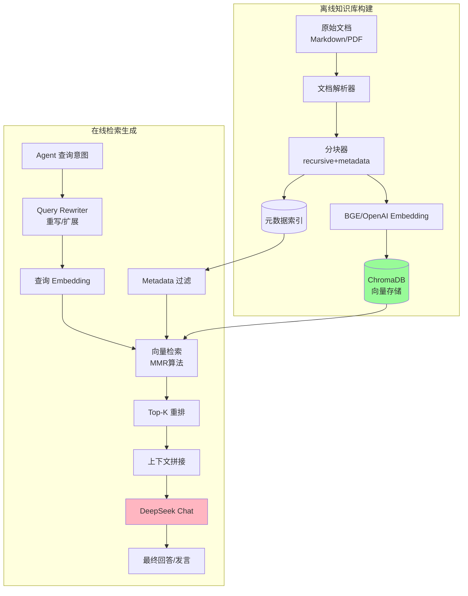
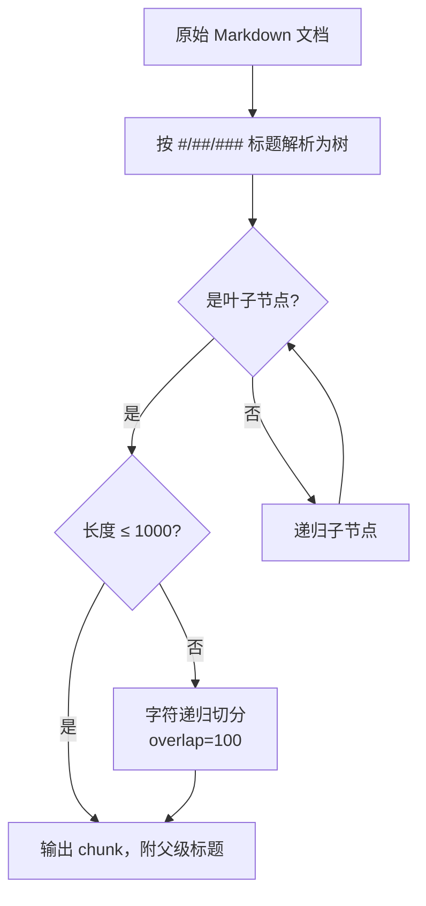
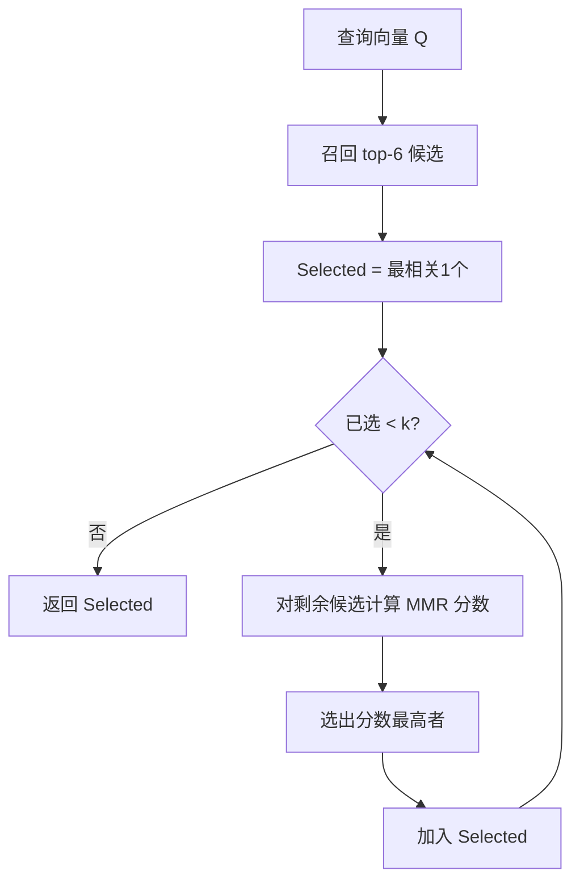
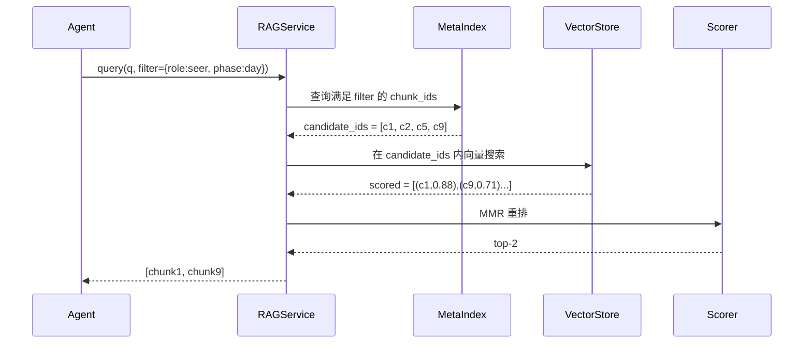
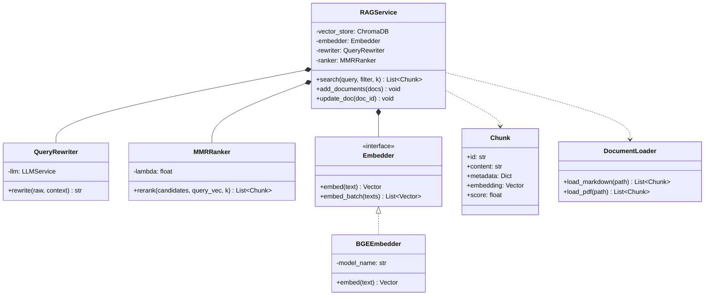
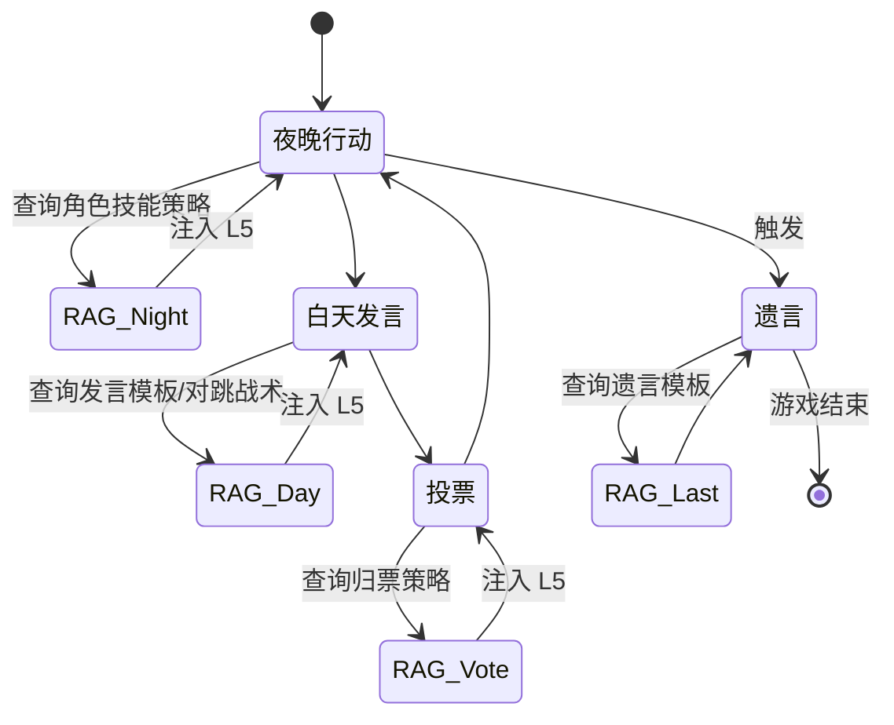
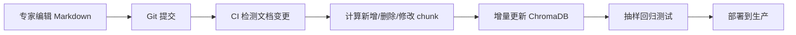

# 第三章 RAG 工程：狼人杀知识库的构建、检索与调优

> 毕业设计论文 · 核心技术章节之三
> 项目：基于大语言模型的 AI 狼人杀游戏系统
> 作者：veennyyang

---

## 3.1 为什么需要 RAG？

### 3.1.1 LLM 的"空心化"问题
直接让 DeepSeek/GPT 回答"新版屠边局 12 人配置女巫首夜应不应该开药"会出现：
- **知识过时**：训练数据不包含 2023 年后的新规则
- **幻觉严重**：编造不存在的战术名词
- **缺乏权威性**：玩家无法验证建议来源

### 3.1.2 RAG 的价值
**Retrieval-Augmented Generation** 让 LLM 在生成前先检索外部知识库，将检索结果作为上下文注入：

| 特性 | 纯 LLM | RAG 增强 |
|------|-------|---------|
| 知识更新 | 依赖重训 | 热更新文档即可 |
| 幻觉率 | 高 | 低（有引文锚定） |
| 可审计 | 无法溯源 | 可指向原始文档 |
| 成本 | 每次调用都是大模型 | 小 embedding + 少量 LLM |

---

## 3.2 RAG 系统整体架构



---

## 3.3 知识库内容体系

### 3.3.1 文档分类与数量

项目当前维护 9 份核心专家文档：

| 类别 | 文档 | 作用 |
|------|------|------|
| 规则 | 12人屠边局规则、经典局规则 | 提供权威游戏规则 |
| 角色 | 预言家手册、女巫手册、狼人战术 | 角色差异化策略 |
| 发言 | 首夜发言模板、警长竞选模板 | 发言结构化引导 |
| 战术 | 悍跳应对、归票策略、警徽流设计 | 高阶战术经验 |
| 变种 | 禁言长老、石像鬼特殊规则 | 新角色辅助 |

### 3.3.2 文档元数据 Schema

每个 chunk 入库时都附带结构化元数据，便于过滤检索：

```json
{
  "doc_id": "expert_seer_manual",
  "category": "role",
  "role": "seer",
  "phase": ["night", "day"],
  "round_applicable": [1, 2, 3],
  "difficulty": "intermediate",
  "tags": ["悍跳", "真预言家", "警徽流"],
  "source": "高玩实战总结 v2"
}
```

---

## 3.4 文档分块策略

### 3.4.1 分块策略对比

| 策略 | 优点 | 缺点 | 适用 |
|------|------|------|------|
| 固定长度切分 | 实现简单 | 切断语义 | 小说等流水内容 |
| 递归字符切分 | 尊重段落边界 | 仍可能切断 | 本项目默认 |
| 语义切分 | 语义完整 | 计算成本高 | 关键文档 |
| Markdown 结构切分 | 保留标题层级 | 不适合非结构文 | 规则文档 |

项目采用 **Markdown 结构切分 + 递归 1000字符** 组合策略：



### 3.4.2 Chunk 示例

原始文档：
```markdown
## 预言家手册
### 首夜查验选择
优先查验发言活跃、位置居中的玩家……

#### 查验 3 号的情况
若查杀狼人，首夜直接悍跳……
```

切分后的 chunk：
```yaml
chunk_id: "seer_01_first_check_wolf"
title_path: "预言家手册 > 首夜查验选择 > 查验 3 号的情况"
content: "若查杀狼人，首夜直接悍跳……"
metadata:
  role: seer
  phase: day
  tags: [悍跳, 查杀]
```

---

## 3.5 向量检索：MMR 算法

### 3.5.1 为什么不用简单 Top-K？

纯余弦相似度 Top-K 检索的问题：**结果过度同质化**。查询"悍跳预言家对跳"时，返回的 5 个 chunk 可能讲的都是同一战术的不同措辞，缺乏多样性。

### 3.5.2 MMR（Maximal Marginal Relevance）

MMR 在相关性与多样性之间做平衡：

```
MMR(D_i) = λ·sim(Q, D_i) - (1-λ)·max[sim(D_i, D_j)]  (D_j ∈ Selected)
```

| 参数 | 值 | 说明 |
|------|-----|------|
| fetch_k | 6 | 先召回 6 个候选 |
| k | 2 | 最终返回 2 个 |
| λ | 0.5 | 相关性与多样性权衡 |

### 3.5.3 MMR 算法流程图



---

## 3.6 Query Rewriting：查询重写

### 3.6.1 为什么需要重写

Agent 实际查询意图多为短语或不规范句子，如：
- "我被女巫救了 怎么发言"
- "刚刚 3 号跳预言家了"

这类查询直接 embedding 检索效果差。重写策略：


### 3.6.2 重写效果对比

| 原始查询 | 重写后 | 检索命中率 |
|---------|-------|-----------|
| "3 号对跳" | "第 1 天出现真预言家与悍跳预言家对跳，好人阵营如何站边" | 42% → 81% |
| "救不救" | "女巫首夜得知被刀玩家身份不明时是否使用解药" | 38% → 75% |

---

## 3.7 元数据过滤检索

### 3.7.1 为什么需要过滤

纯向量相似度可能把**村民场景的发言模板**推给**预言家 Agent**，导致角色错位。解决方案：硬过滤 + 向量排序。

### 3.7.2 过滤 + 检索管线



### 3.7.3 元数据过滤模板

| 场景 | Filter 示例 |
|------|-----------|
| 预言家白天发言 | `{role:"seer", phase:"day"}` |
| 狼人首夜刀人 | `{role:"werewolf", phase:"night", round:1}` |
| 警上发言 | `{tags:{$in:["警长竞选"]}}` |
| 遗言 | `{phase:"last_words"}` |

---

## 3.8 RAG 类图



---

## 3.9 RAG 在游戏流程中的触发点



---

## 3.10 RAG 质量评估

### 3.10.1 评估指标

| 指标 | 定义 | 目标 |
|------|------|------|
| Recall@k | 前 k 结果中命中正确答案的比例 | ≥ 0.80 |
| MRR | 平均倒数排名 | ≥ 0.65 |
| 上下文相关度 | 检索内容与问题相关度（GPT-4 评分） | ≥ 4.0/5 |
| 答案忠实度 | 回答是否仅基于检索内容 | ≥ 90% |

### 3.10.2 真实调优效果

| 版本 | 策略 | Recall@2 | MRR | 上下文相关度 |
|------|------|---------|-----|------------|
| V1 | 裸向量 top-2 | 0.58 | 0.42 | 3.1/5 |
| V2 | + Query Rewrite | 0.71 | 0.55 | 3.8/5 |
| V3 | + MMR | 0.76 | 0.60 | 3.9/5 |
| V4 | + Metadata Filter | 0.85 | 0.71 | 4.3/5 |

---

## 3.11 热更新与版本管理



关键点：
- **不重建**：仅增量 upsert/delete
- **版本号**：每个 chunk 带 version 字段，便于回滚
- **测试**：每次更新后跑 20 个固定 query 的回归测试

---

## 3.12 RAG 工程的典型陷阱与解决

| 陷阱 | 现象 | 解决 |
|------|------|------|
| Chunk 过小 | 语义残缺，命中率低 | 提升到 500~1000 字 |
| Chunk 过大 | 稀释关键信息 | 配合 re-rank |
| 无 metadata | 角色错位 | 强制 schema |
| 无 query rewrite | 短查询效果差 | 接 LLM 重写 |
| 无多样性 | 结果同质 | MMR |
| 盲目信任检索 | 幻觉仍在 | Prompt 要求"仅基于下文回答" |

---

## 3.13 本章小结

本章系统阐述了 AI 狼人杀系统中的 RAG 工程实践，涵盖 **文档分块、向量检索、MMR 多样性、元数据过滤、查询重写、热更新**六大核心模块，并通过 4 个版本的对比验证了每项技术的实际增益。下一章将转向游戏侧：如何用有限状态机保证 12 人复杂游戏流程的确定性。
