# 第四章 游戏状态机：狼人杀流程的确定性建模

> 毕业设计论文 · 核心技术章节之四
> 项目：基于大语言模型的 AI 狼人杀游戏系统
> 作者：veennyyang

---

## 4.1 引言：为什么要用状态机

### 4.1.1 狼人杀流程的复杂性
12 人板子一局游戏包含：
- **8~10 轮昼夜循环**
- **每轮 5~8 个阶段**（夜晚技能顺序、天亮结算、警长竞选、自由发言、投票、放逐、遗言）
- **12 种角色**的技能触发时机各异
- **多种中断**（自爆、猎人开枪、骑士决斗、女巫毒）

若用 `if-else` 堆砌处理所有分支，代码可读性会在 200 行后崩溃，且极易出现：
- **状态不一致**：前端以为夜晚、后端已进入白天
- **技能错过时机**：女巫救药 / 猎人开枪被吞
- **并发投票**：两个玩家同时投出死人

### 4.1.2 有限状态机（FSM）的价值
| 特性 | 意义 |
|------|------|
| **显式状态枚举** | 所有合法状态一目了然 |
| **转换条件白名单** | 非法跳转被守卫阻断 |
| **动作钩子** | 进入/离开状态时自动触发 |
| **可测试** | 每条转换可单元测试 |
| **可持久化** | 状态名+字段即完整游戏快照 |

---

## 4.2 整体状态层次

项目的状态机采用 **两级层次**：

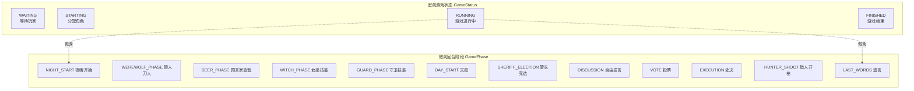

---

## 4.3 宏观状态转换图

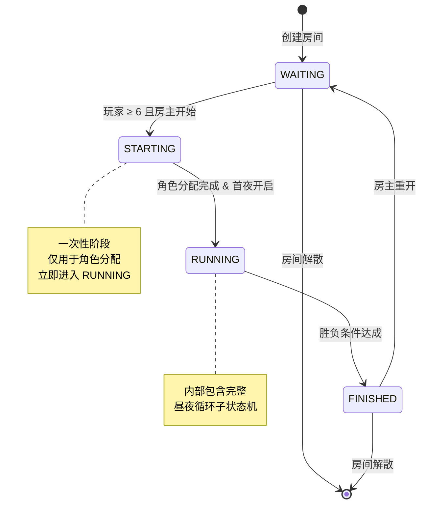

---

## 4.4 微观回合阶段图（重点）

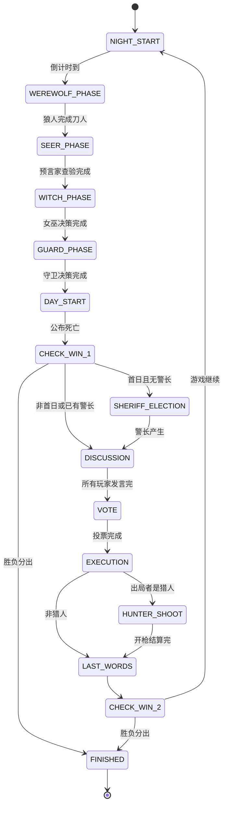

### 4.4.1 阶段说明表

| 阶段 | 时长 | 可见玩家 | 关键动作 |
|------|------|---------|---------|
| NIGHT_START | 即时 | 全部 | 播报夜晚开始 |
| WEREWOLF_PHASE | 30s | 狼人 | 选择击杀目标 |
| SEER_PHASE | 30s | 预言家 | 选择查验目标 |
| WITCH_PHASE | 30s | 女巫 | 救/毒/跳过 |
| GUARD_PHASE | 30s | 守卫 | 选择守护目标 |
| DAY_START | 即时 | 全部 | 公布死亡信息 |
| SHERIFF_ELECTION | 120s | 全部 | 上警+竞选演讲+投票 |
| DISCUSSION | 12×60s | 全部 | 轮流发言 |
| VOTE | 30s | 存活玩家 | 投票放逐 |
| EXECUTION | 即时 | 全部 | 公布出局者 |
| HUNTER_SHOOT | 30s | 猎人 | 选择开枪目标 |
| LAST_WORDS | 45s | 出局者 | 遗言 |

---

## 4.5 状态机核心类图

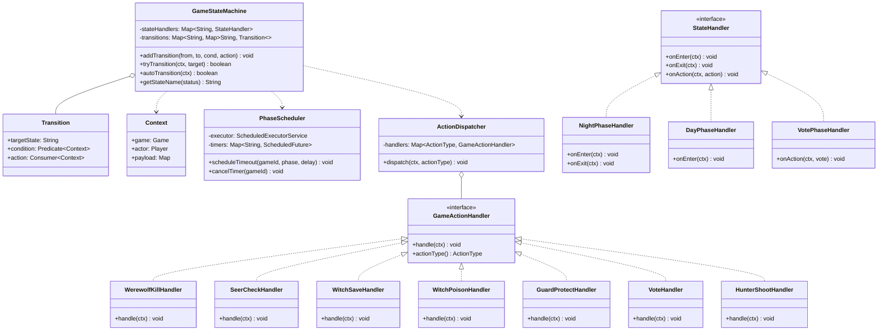

---

## 4.6 核心转换时序：第 1 天完整流程

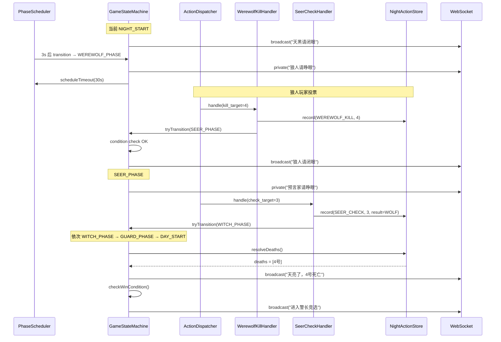

---

## 4.7 状态一致性与守卫条件

### 4.7.1 Transition Guard（转换守卫）

每条转换必须通过 `Predicate<Context>` 守卫：

| From → To | 守卫条件 |
|----------|---------|
| WAITING → STARTING | `players >= 6` |
| NIGHT_START → WEREWOLF_PHASE | `timer_elapsed || all_ready` |
| WEREWOLF_PHASE → SEER_PHASE | `wolves_decided_all()` |
| SEER_PHASE → WITCH_PHASE | `seer_decided() || seer_dead()` |
| VOTE → EXECUTION | `all_alive_voted() || timeout` |
| CHECK_WIN → NIGHT_START | `winner == NONE` |
| CHECK_WIN → FINISHED | `winner != NONE` |

### 4.7.2 非法转换的处理

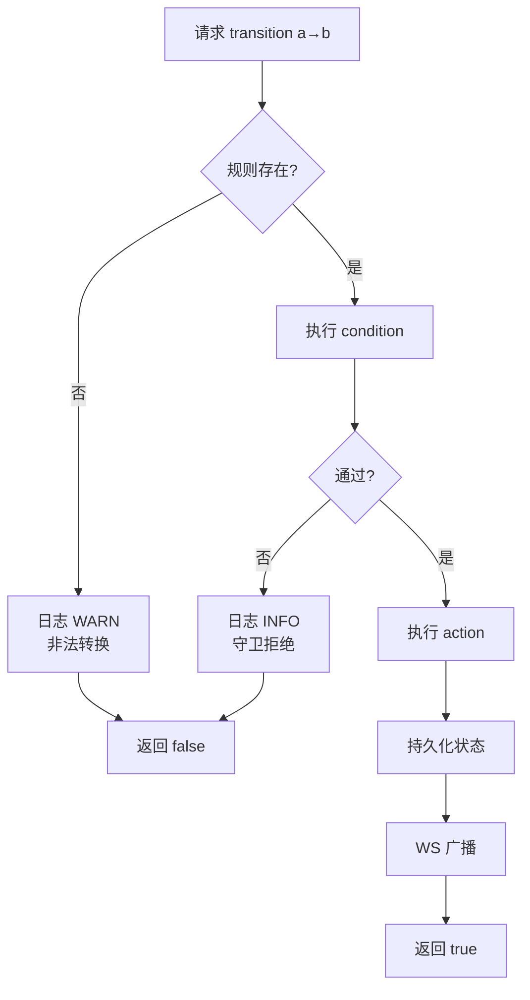

---

## 4.8 胜负条件判定

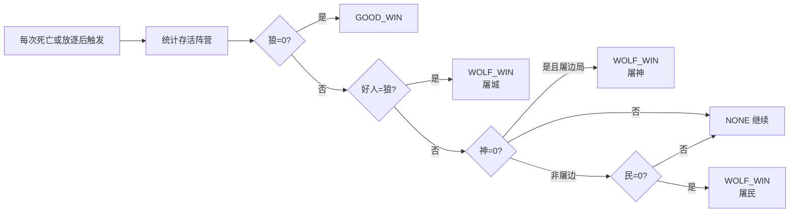

---

## 4.9 定时器与超时

### 4.9.1 双定时器设计

每个阶段同时存在两个定时器：
- **阶段总时长定时器**：到点强制推进
- **心跳定时器**：3s 一次广播剩余时间

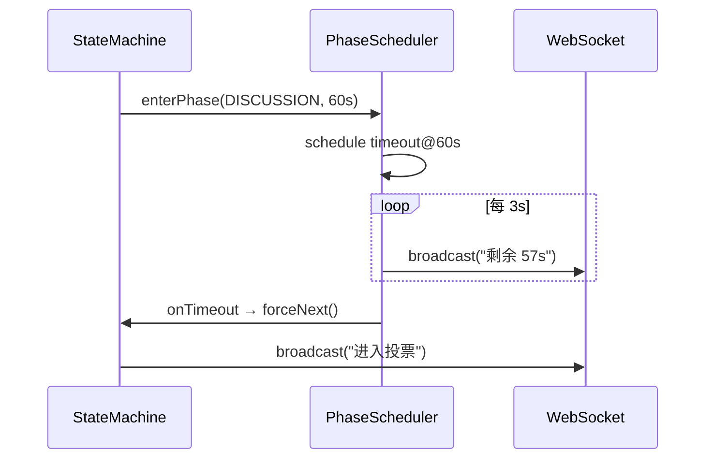

### 4.9.2 提前结束机制

若所有存活玩家都已行动，可跳过剩余等待：

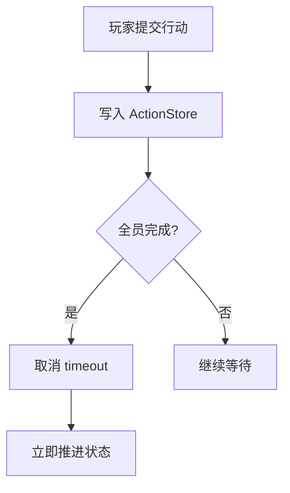

---

## 4.10 状态持久化

### 4.10.1 持久化模型

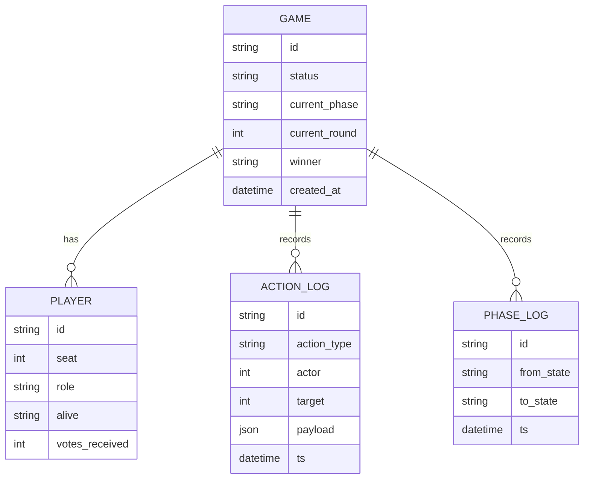

### 4.10.2 断线重连

玩家断线重连时的恢复流程：

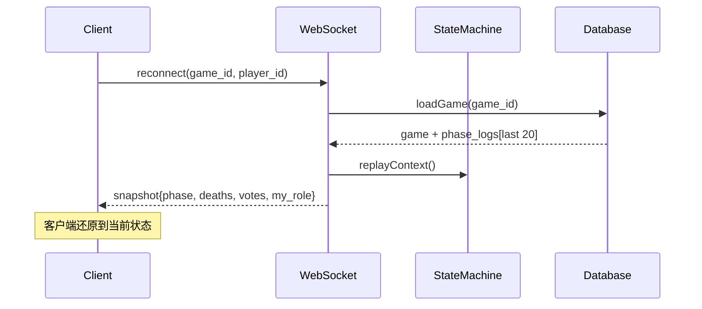

---

## 4.11 状态机的可测试性

每条 transition 都可以独立单元测试：

```java
@Test
void test_night_to_day_only_after_all_roles_acted() {
    Game game = buildGame(12);
    Context ctx = new Context(game);
    ctx.getGame().setCurrentPhase(WEREWOLF_PHASE);

    // 狼人未全部决策，应被拒绝
    assertFalse(fsm.tryTransition(ctx, "SEER_PHASE"));

    // 模拟所有狼人决策
    nightActionStore.recordAllWolvesVoted(game.getId(), 4);
    assertTrue(fsm.tryTransition(ctx, "SEER_PHASE"));
}
```

覆盖率目标：**所有 transition 必须有正反两组测试**。

---

## 4.12 本章小结

本章通过 **两级层次化有限状态机** 完整建模了狼人杀复杂的昼夜流程，结合守卫条件、定时器、行动分发器、动作日志四大机制，使后端具备：
- **确定性**：任何时刻只能处于一个合法状态
- **可审计性**：每次转换留痕
- **可恢复性**：断线可还原
- **可测试性**：每条转换可单测

下一章将讨论这个严密的状态机如何通过 WebSocket 与前端保持一致——即前后端通信的状态同步问题。
