# 第五章 前后端通信与游戏状态一致性

> 毕业设计论文 · 核心技术章节之五
> 项目：基于大语言模型的 AI 狼人杀游戏系统
> 作者：veennyyang

---

## 5.1 引言：分布式场景下的状态一致性挑战

### 5.1.1 狼人杀对通信的特殊要求

| 维度 | 传统业务系统 | 狼人杀游戏 |
|------|------------|----------|
| 实时性 | 秒级可接受 | 必须毫秒级 |
| 视角 | 所有人相同 | 每个玩家看到的不同 |
| 顺序性 | 大部分无序即可 | 严格时序（先死后刀不合法） |
| 一致性 | 最终一致 | 强一致（客户端不能出现矛盾状态） |
| 防作弊 | 前端可见即可 | 必须隐藏身份/技能信息 |

### 5.1.2 本章目标
阐述项目如何通过：
- **WebSocket 全双工通信**
- **事件驱动的状态同步**
- **权威服务器 + 客户端预测**
- **消息版本号与幂等处理**
- **差异视角推送**

……保证 12 个前端 + 12 个 AI Agent + 1 个权威后端在整局游戏中视角一致、操作安全。

---

## 5.2 通信架构总览

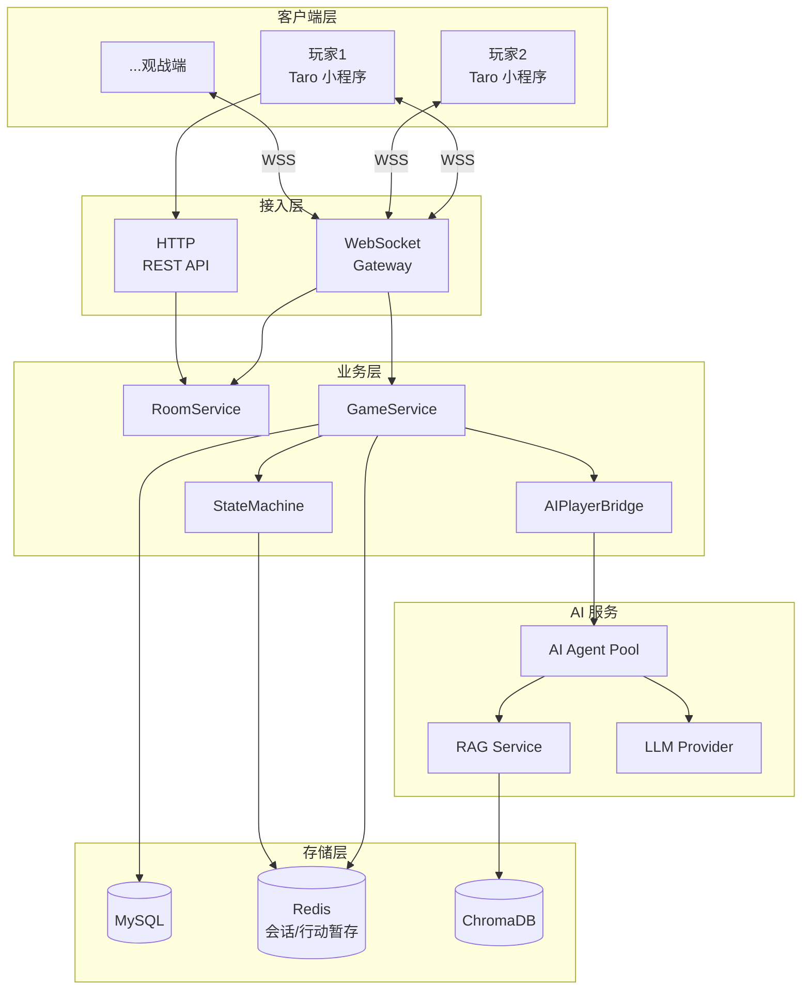

---

## 5.3 协议选型：为什么是 WebSocket

### 5.3.1 方案对比

| 方案 | 优点 | 缺点 | 是否采用 |
|------|------|------|---------|
| HTTP 轮询 | 实现简单 | 延迟高、浪费带宽 | ❌ |
| HTTP 长轮询 | 比短轮询好 | 连接重建成本 | ❌ |
| SSE | 服务端推送好 | 单向、浏览器兼容 | ❌ |
| **WebSocket** | **全双工、低延迟、低开销** | **需额外基础设施** | ✅ |
| gRPC-Web | 强类型 | 小程序支持差 | ❌ |

### 5.3.2 小程序适配

微信小程序的 WebSocket 限制：
- 必须 **WSS**（线上）
- 必须通过 `wx.connectSocket` API
- 本地开发可用 `ws://` 但需勾选"不校验合法域名"
- 每个小程序同时只能有 5 个 socket

项目通过封装统一 SocketClient：

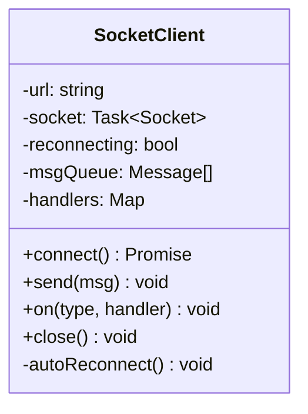

---

## 5.4 消息协议设计

### 5.4.1 基础消息结构

```typescript
interface WSMessage<T = any> {
  type: string;           // 消息类型（事件名）
  msg_id: string;         // 幂等 ID（UUID）
  version: number;        // 状态版本号
  ts: number;             // 服务器时间戳
  payload: T;             // 业务数据
  private?: boolean;      // 是否私密（狼人频道等）
}
```

### 5.4.2 消息分类

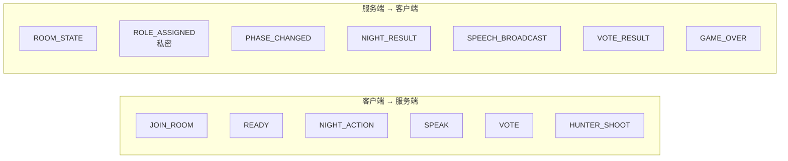

### 5.4.3 关键消息字段示例

#### PHASE_CHANGED（广播）
```json
{
  "type": "PHASE_CHANGED",
  "msg_id": "a3f9-...",
  "version": 47,
  "ts": 1714812000123,
  "payload": {
    "from": "DISCUSSION",
    "to": "VOTE",
    "round": 2,
    "deadline_ts": 1714812030000,
    "active_players": [1, 2, 3, 5, 7, 9, 11]
  }
}
```

#### ROLE_ASSIGNED（仅发给本人）
```json
{
  "type": "ROLE_ASSIGNED",
  "msg_id": "b12e-...",
  "version": 3,
  "payload": {
    "seat": 7,
    "role": "SEER",
    "teammates": null,
    "skill_hint": "每晚可查验一名玩家身份"
  }
}
```

---

## 5.5 状态同步模型：快照 + 增量

### 5.5.1 两种同步方式对比

| 方式 | 实现 | 优点 | 缺点 |
|------|------|------|------|
| 纯快照 | 每次推整个 GameState | 简单 | 流量大 |
| 纯增量 | 只推变化字段 | 省流量 | 客户端易失步 |
| **快照+增量** | **首次快照，之后增量** | **平衡** | **稍复杂** |

项目采用混合策略：

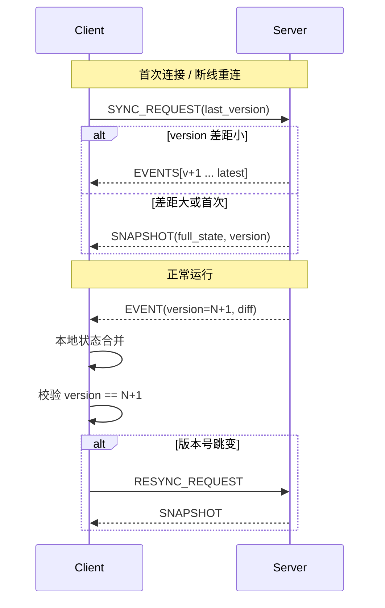

### 5.5.2 版本号机制

每次状态变更后，`version++`。客户端严格校验递增，一旦发现跳号（如 47→49）立即请求重同步。

---

## 5.6 差异化视角推送（Fog of War）

### 5.6.1 视角差异场景

| 事件 | 狼人看到 | 预言家看到 | 普通好人看到 |
|------|---------|-----------|------------|
| 夜晚狼人刀人 | 队友+目标 | 无 | 无 |
| 预言家查验 | 无 | 目标+结果 | 无 |
| 女巫救/毒 | 无 | 无 | 无 |
| 天亮公布死亡 | 全部 | 全部 | 全部 |
| 狼人聊天频道 | 狼队 | 无 | 无 |

### 5.6.2 推送路由器（PushRouter）

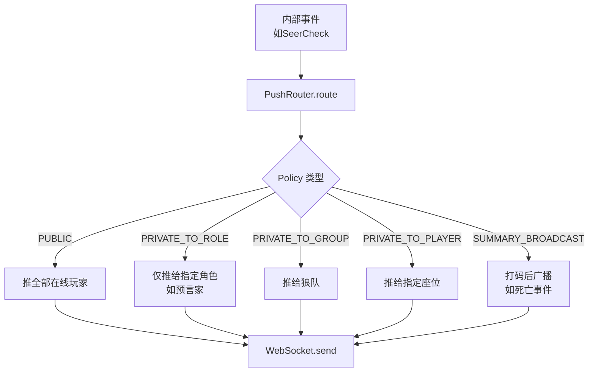

### 5.6.3 视角过滤器实现

以"玩家 4 死亡"为例：

```java
public void onPlayerDied(Game game, Player died) {
    // 对全体：只说死了谁，不说身份
    pushRouter.publicBroadcast(game, PlayerDiedMsg.summary(died));

    // 对死者自己：告知身份已翻牌
    pushRouter.privateToPlayer(game, died, PlayerDiedMsg.full(died));

    // 对狼队：如果死者是狼，通知队友
    if (died.isWolf()) {
        pushRouter.privateToGroup(game, Camp.WOLF, TeammateDiedMsg.of(died));
    }
}
```

---

## 5.7 客户端预测与权威服务器

### 5.7.1 纯服务器驱动 vs 客户端预测

| 模式 | 响应感 | 一致性 | 实现 |
|------|-------|-------|------|
| 纯服务器驱动 | 有延迟感 | 强一致 | 简单 |
| **客户端预测+回滚** | 即时反馈 | 最终一致 | 稍复杂 |

项目对"非关键操作"采用预测：

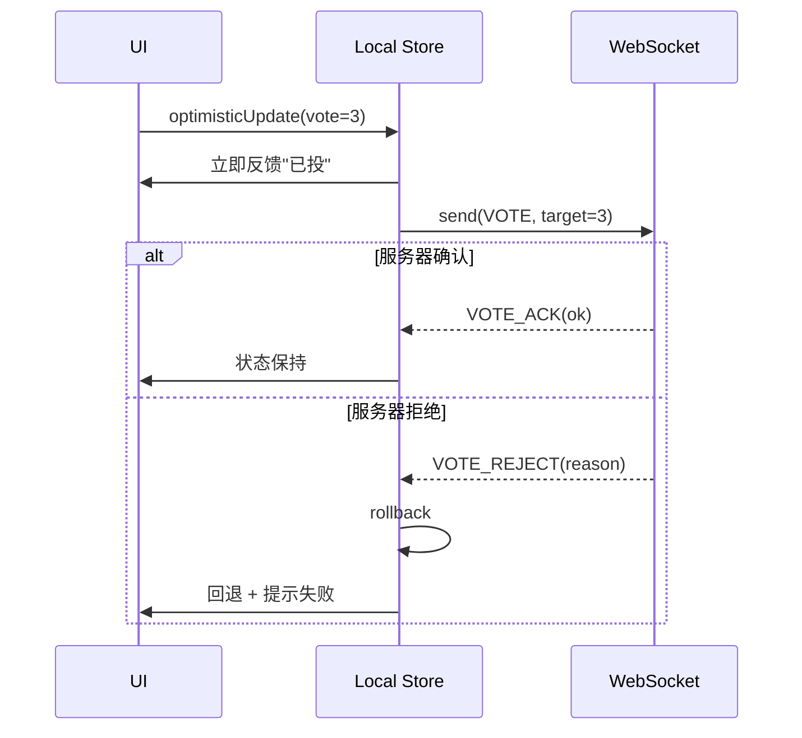

### 5.7.2 哪些能预测，哪些不能

| 操作 | 预测 | 原因 |
|------|-----|------|
| 发言 UI 本地显示 | ✅ | 不影响游戏逻辑 |
| 投票选中 | ✅ | 可回滚 |
| 夜晚技能选中 | ✅ | 可回滚 |
| 角色分配 | ❌ | 必须服务器权威 |
| 死亡结算 | ❌ | 严格顺序 |
| 胜负判定 | ❌ | 严格权威 |

---

## 5.8 幂等与重复消息处理

### 5.8.1 幂等 ID 机制

客户端每条消息带唯一 `msg_id`，服务器用 Redis `SETNX` 判重：

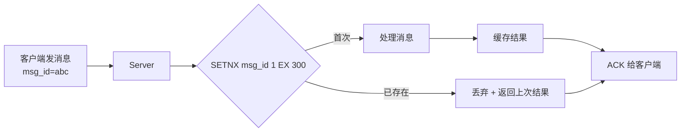

### 5.8.2 超时重发

WebSocket 本身不保证送达。客户端对**关键操作**（投票/技能）5s 未收到 ACK 则重发：

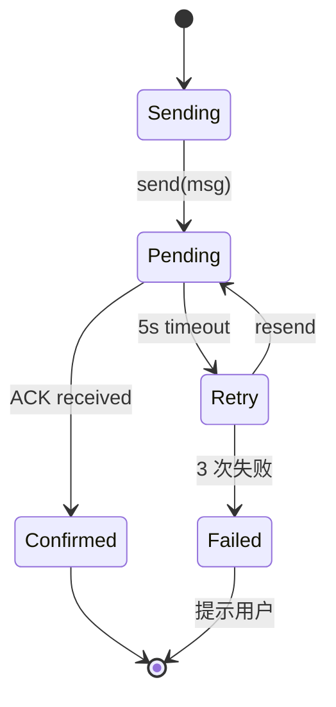

---

## 5.9 心跳与断线重连

### 5.9.1 心跳协议

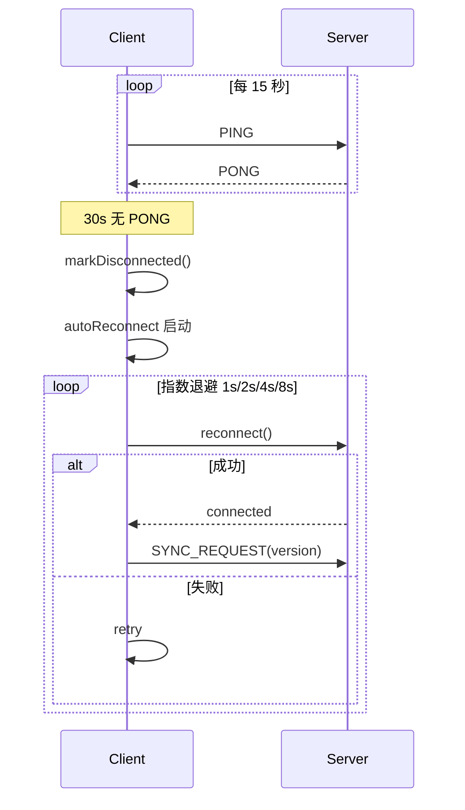

### 5.9.2 小程序后台限制

微信小程序切到后台后，WebSocket 会被保留约 5 分钟然后断开。项目策略：
- `onHide`：发送 `BACKGROUND` 通知服务器
- `onShow`：立即检查连接并重同步
- 超过 5 分钟未回来：标记该玩家"托管"交给 AI 替操

---

## 5.10 消息流量控制

### 5.10.1 频率限制

| 消息类型 | 限流规则 |
|---------|---------|
| SPEAK | 每秒最多 3 条 |
| VOTE | 每阶段最多 1 次有效 |
| NIGHT_ACTION | 每阶段最多 1 次 |
| PING | 15s 一次 |

### 5.10.2 广播扇出优化

12 玩家 × 每轮约 15 个事件 = 180 次推送。对观战者更多：

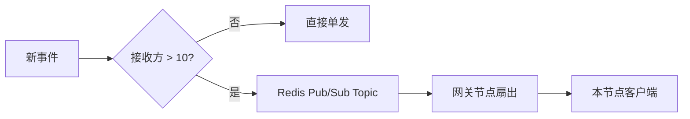

---

## 5.11 端到端一致性流程：以"一次投票"为例

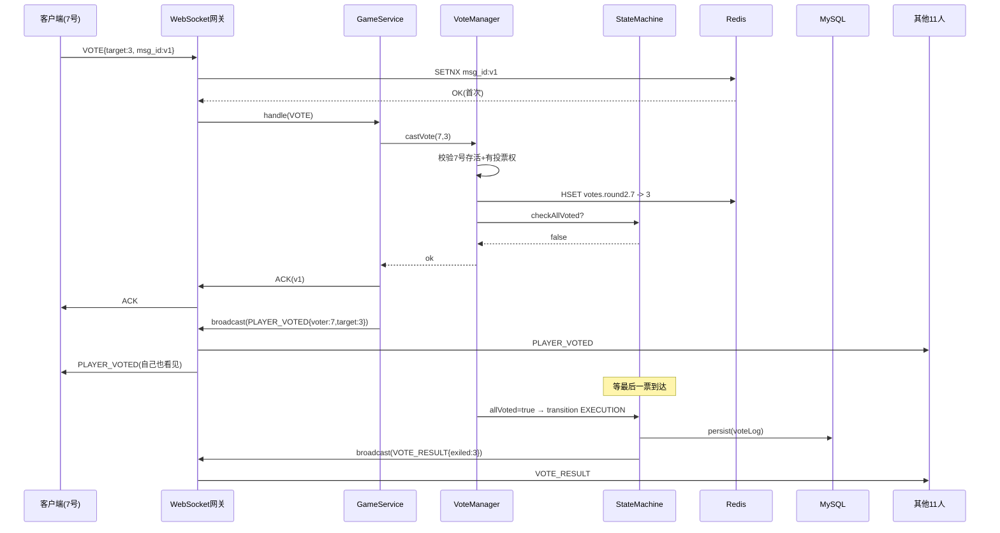

---

## 5.12 异常场景与容错

| 异常 | 现象 | 处理 |
|------|------|------|
| 网关节点宕机 | 玩家断线 | 客户端重连到新节点，SYNC 恢复 |
| Redis 故障 | 幂等失效、行动暂存丢失 | 降级：使用 MySQL 行锁替代 |
| 消息乱序 | version 不连续 | 客户端触发 RESYNC |
| 客户端作弊改包 | 非法 action | 服务端守卫拒绝+封禁 |
| LLM 超时 | AI 发言卡住 | 15s 超时→默认"过"+后台日志 |

---

## 5.13 本章小结

本章从协议选型、消息结构、同步模型、差异视角、预测回滚、幂等重发、断线重连、流量控制、端到端流程、异常容错 **十个维度** 完整阐述了 AI 狼人杀系统中前后端状态一致性的工程实现。五个核心章节至此构成闭环：

- **第一章 Prompt 工程** 解决"AI 说什么"
- **第二章 Agent 记忆** 解决"AI 记什么"
- **第三章 RAG 工程** 解决"AI 学什么"
- **第四章 游戏状态机** 解决"游戏怎么流转"
- **第五章 通信与一致性** 解决"前后端/人机如何协同"

五章共同构成基于大语言模型的 AI 狼人杀游戏系统的核心技术栈。
